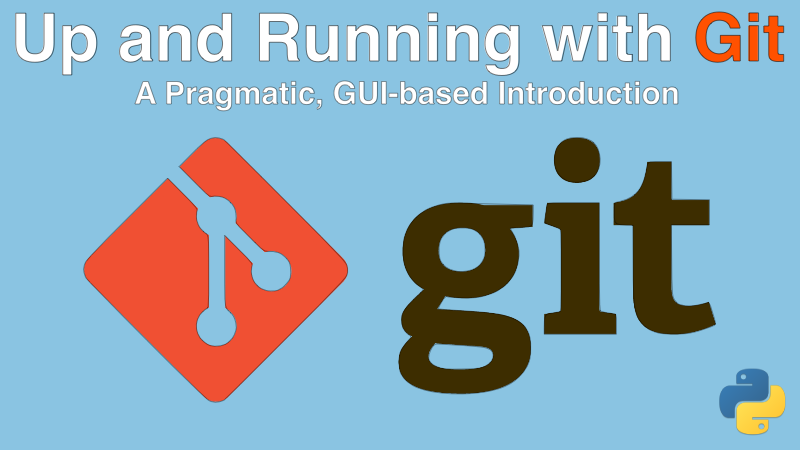

# Up and Running with Git: A pragmatic, UI-based approach

# Featured repositories

We created several repositories during the course. We've made them public and you can access them here:

* **[github.com/mikeckennedy/funny-web](https://github.com/mikeckennedy/funny-web)**
* **[github.com/mikeckennedy/sketchy-rock-paper-scissors](https://github.com/mikeckennedy/sketchy-rock-paper-scissors)**

## Course Summary

This course takes an unconventional and pragmatic approach to git and source control and will get you up to speed very quickly. Many git courses take a least common denominator approach and decide you need to learn "pure" git. That is, just the commands right in the terminal or command prompt.

Not **Up and Running with Git**. This course teaches you how to use git by leveraging the best UI tools from common editors such as Visual Studio Code and PyCharm as well as highly polished git applications including Atlassian's Sourcetree.

## What will you learn?

In this course, you will:

- How modern git-oriented editors and applications can **level up your understanding of your git repository**
- **The 6 core git concepts** you need to understand to be effective with git (yes, just 6!)
- Gain a clear understanding of what **distributed source control** is and how to visualize it
- Work with source control using the **most popular editors**: PyCharm and Visual Studio Code
- **Create a new open source project** with git and GitHub
- Commit and **track core files** from your project, while **excluding files that don't belong** in source control
- **Synchronize with remote** / hosted repositories
- Merge file changes automatically and **manually using 3-way merge tools**
- Learn about the **advantages of branching** for parallel work
- Understand **the 5 key reasons for branching** and how they are similar and different
- Tips and techniques for **limiting merge conflicts across branches** over time
- Use **GitFlow and PRs** to make (and receive) an open source contribution
- Many **tips and tricks for improving your computer** for working with git
- And lots more

## Who is this course for?

For anyone who needs to **get better using git and source control**. If you are brand new to git, the pragmatic and UI-based approach will help you get up to speed faster. And if you are an experienced developer, you'll see how choosing the right tools will multiply your productivity and insight into your code.

As for prerequisites, we assume:

- **No git or source control experience** required
- Familiarity with some programming language (we use Python but just a little)

The tools chosen and featured during this course are **100% free and most of them are open source**.

## The time to act is now

Git has become the defacto way we build software. If you are not up to speed with git and source control, you'll be at a disadvantage. This course is focused on using the best tools to provide a deep and meaningful understanding of git. **[Take the course](https://training.talkpython.fm/courses/up-and-running-with-git-a-pragmatic-ui-based-introduction), level up your productivity today**.

